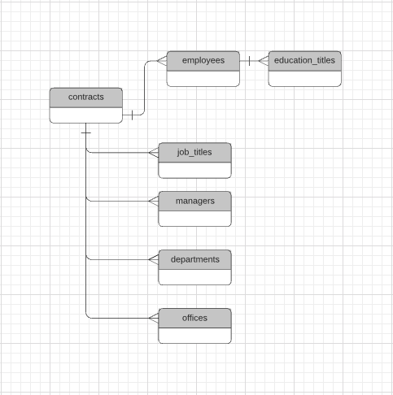
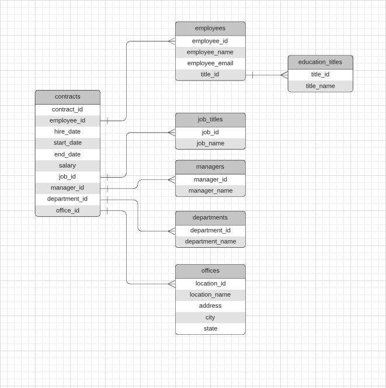
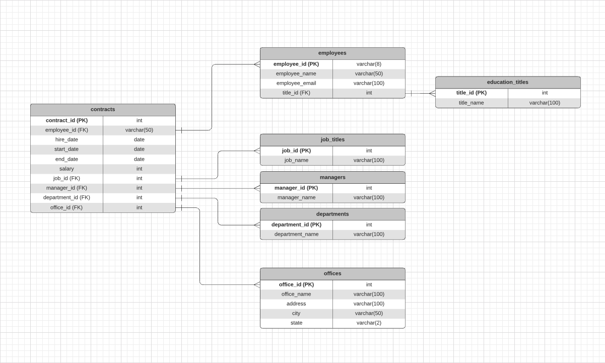

# data-modelling-template
Template of a data modelling problem.  
Developed to complete the Data Architect Udacity Nanodegree.

The request is to handle a database migration 
in the context of an HR department and to develop:
- a business and technical proposal 
- a physical implementation  

## Reports
- [Business Report](doc/BusinessReport.md)
- [Technical Report](doc/TechnicalReport.md)

## Implementation
To run the sql scripts refer to the [Usage](doc/Usage.md) page

## Entity Relationship Diagram (ERD)
### Conceptual

### Logical

### Physical

